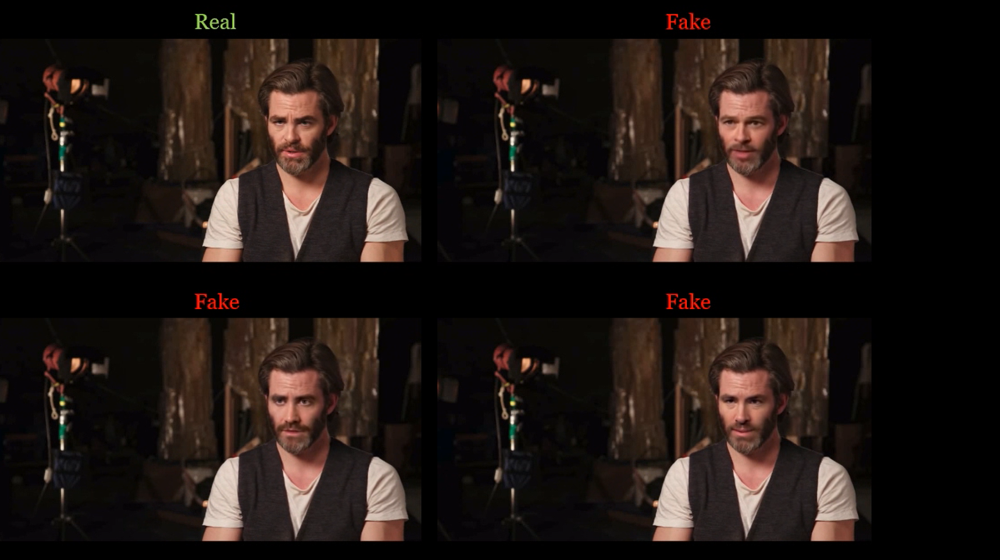

# Celeb-DF (v1): A New Dataset for DeepFake Forensics

[Yuezun Li<sup>1</sup>](https://www.albany.edu/~yl149995/), 
Xin Yang<sup>1</sup>, Pu Sun<sup>2</sup>, Honggang Qi<sup>2</sup> and [Siwei Lyu<sup>1</sup>](http://www.cs.albany.edu/~lsw/)</br>
<sup>1</sup> University at Albany, State University of New York, USA; 
<sup>2</sup> University of Chinese Academy of Sciences, China</br>

Celeb-DF (v1) dataset contains real and DeepFake synthesized videos having similar visual quality on par with those circulated online. The Celeb-DF dataset includes 408 original videos collected from YouTube with subjects of different ages, ethic groups and genders, and 795 DeepFake videos synthesized from these real videos.

<a href="https://youtu.be/vLTiluewGQY">

</a>

Video Demo of our dataset

### Download
If you would like to access the Celeb-DF dataset, 
please fill out [this form](https://forms.gle/2jYBby6y1FBU3u6q9)
. The download link will be sent to you once the form is accepted. If you have any questions, please send email to [deepfakeforensics@gmail.com]() 

Please cite our paper in your publications if the Celeb-DF dataset is used in your research:
```
@inproceedings{Celeb_DF_cvpr20,
   author = {Yuezun Li, Xin Yang, Pu Sun, Honggang Qi and Siwei Lyu},
   title = {Celeb-DF: A Large-scale Challenging Dataset for DeepFake Forensics},
   booktitle= {IEEE Conference on Computer Vision and Patten Recognition (CVPR)},
   year = {2020}
}
```

### Dataset Structure
```commandline
Celeb-DF
|--- Celeb-real # Celebrity videos downloaded from YouTube
|--- YouTube-real # Additional videos downloaded from YouTube
|--- Celeb-synthesis # Synthesized videos from Celeb-real
|--- List_of_testing_videos.txt 
```

### Go to [Celeb-DF (v2)](../README.md).

