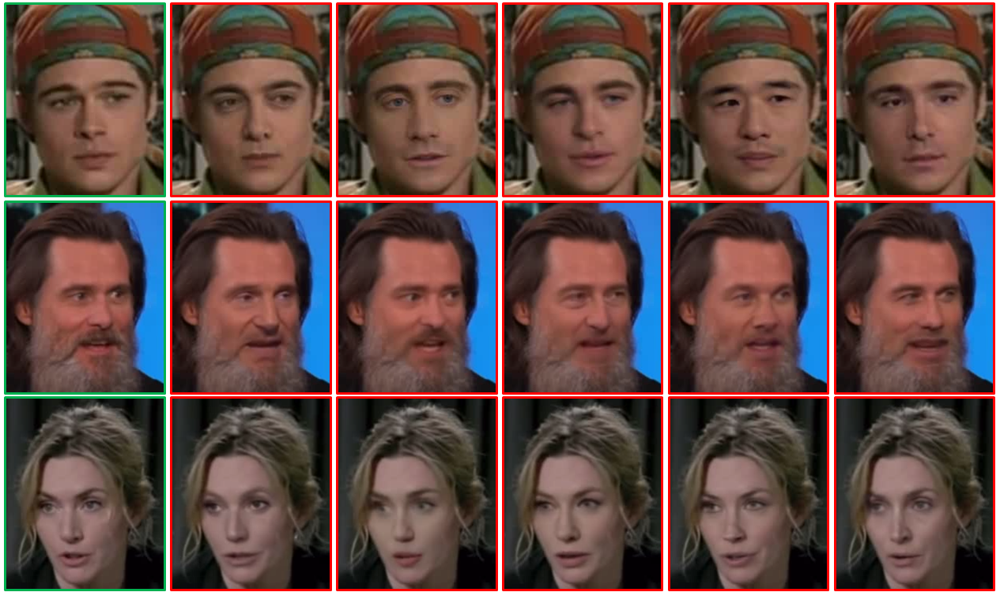
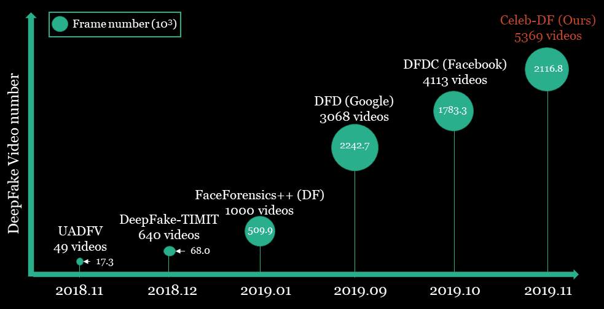
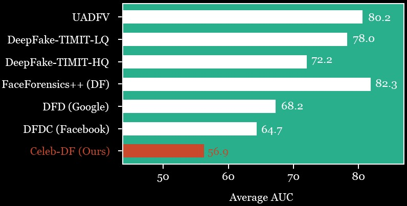

# Celeb-DF: A Large-scale Challenging Dataset for DeepFake Forensics




### Overview

Celeb-DF dataset includes 590 original videos collected from YouTube with subjects of different ages, ethic groups and genders, and 5639 corresponding DeepFake videos. 
See [paper](https://arxiv.org/abs/1909.12962) for details (full paper will be uploaded soon). 


### Download
If you would like to access the Celeb-DF dataset, 
please fill out this [google form](https://forms.gle/2jYBby6y1FBU3u6q9) or [tencent form](https://wj.qq.com/s2/8540155/b5d9/). The download link will be sent to you once the form is accepted. If you have any questions, please send email to [deepfakeforensics@gmail.com]() 

Please cite our paper in your publications if the Celeb-DF dataset is used in your research:
```
@inproceedings{Celeb_DF_cvpr20,
   author = {Yuezun Li, Xin Yang, Pu Sun, Honggang Qi and Siwei Lyu},
   title = {Celeb-DF: A Large-scale Challenging Dataset for DeepFake Forensics},
   booktitle= {IEEE Conference on Computer Vision and Patten Recognition (CVPR)},
   year = {2020}
}
```

### Dataset Structure
```commandline
Celeb-DF
|--- Celeb-real # 590 Celebrity videos downloaded from YouTube
|--- YouTube-real # 300 Additional videos downloaded from YouTube
|--- Celeb-synthesis # 5639 Synthesized videos from Celeb-real
|--- List_of_testing_videos.txt # 518 videos
```
### Comparison with Other Datasets


See [paper](https://arxiv.org/abs/1909.12962) for details.

### Average AUC Performance of SOTA Detection Methods on Each Dataset


See [paper](https://arxiv.org/abs/1909.12962) for details.

### Privacy Statement
This dataset is released under the [Terms to Use Celeb-DF](https://forms.gle/2jYBby6y1FBU3u6q9), which
is provided "as it is" and we are not responsible for any subsequence from using this dataset.
All original videos of the Celeb-DF dataset are obtained from the Internet which
are not property of the authors or the authors’ affiliated institutions. Neither the
authors or the authors’ affiliated institution are responsible for the content nor the
meaning of these videos. If you feel uncomfortable about your identity shown in this dataset, please contact us and we will 
remove corresponding information from the dataset. 


### Video Demo

<a href="https://youtu.be/vLTiluewGQY">

</a>

### Log

* The Celeb-DF (v2) is accepted to CVPR2020.
* Check [here](Celeb-DF-v1/README.md) for previous Celeb-DF (v1) (795 DeepFake videos included). 

### Reference
<sub>
[UADFV] Yang, Xin and Li, Yuezun and Lyu, Siwei. 
"Exposing Deep Fakes Using Inconsistent Head Poses",
IEEE International Conference on Acoustics, Speech and Signal Processing (ICASSP), 2019 
</br>
[DeepFake-TIMIT] Korshunov, Pavel and Marcel, Sebastien.
"DeepFakes: a New Threat to Face Recognition? Assessment and Detection",
arXiv preprint arXiv:1812.08685, 2018 </br>
[FaceForensics++] Andreas Rössler and Davide Cozzolino and Luisa Verdoliva and Christian Riess and Justus Thies and Matthias Nießner.
"FaceForensics++: Learning to Detect Manipulated Facial Images",
IEEE International Conference on Computer Vision (ICCV), 2019
</br>
[DFD (Google)] Nicholas Dufour, Andrew Gully, Per Karlsson, Alexey Vic-tor Vorbyov, Thomas Leung, Jeremiah Childs, and ChristophBregler. 
Deepfakes detection dataset by google & jigsaw.
</br>
[DFDC (Facebook)] Brian   Dolhansky,    Russ   Howes,    Ben   Pflaum, NicoleBaram,  and  Cristian  Canton  Ferrer.    The  deepfake  detec-tion  challenge  (DFDC)  preview  dataset.
arXiv  preprintarXiv:1910.08854, 2019.


</sub>

