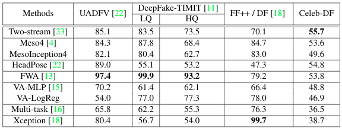

# Celeb-DF: A New Dataset for DeepFake Forensics

Yuezun Li, Xin Yang, Pu Sun, Honggang Qi and [Siwei Lyu](http://www.cs.albany.edu/~lsw/)
## Overview
**DeepFake Forensics (Celeb-DF)** dataset contains  real and DeepFake synthesized videos having similar visual quality on par with those circulated online.
The Celeb-DF dataset includes 158 celebrity videos collected from YouTube with different ages, ethic groups and genders, and 795 DeepFake videos synthesized from these real videos. 

A demo video can be viewed [here](https://youtu.be/vLTiluewGQY):

<a href="https://youtu.be/vLTiluewGQY">

</a>


## Celeb-DF Dataset

#### Download
If you would like to access the Celeb-DF dataset, 
please fill out [this form](https://drive.google.com/open?id=1QWk__2EY8_vwFnLiZmjHYtQmaCccy5ht)
and send it to [deepfakeforensics@gmail.com](). The download link will be sent to you once the form is accepted.


#### Dataset Structure
```commandline
Celeb-DF
|--- Celeb-real # Celebrity videos downloaded from YouTube
|--- YouTube-real # Additional videos downloaded from YouTube
|--- Celeb-DF # Synthesized videos from Celeb-real
|--- List_of_testing_videos.txt 
```

#### Evaluation
Based on the Celeb-DF dataset, we evaluate the performance of several recent 
DeepFake detection methods that have code publicly available. Since not all methods have the code for training,
we use the released model performed on all datsets for evaluation.



## Citation
Please cite our [paper]() in your publications if the Celeb-DF dataset is used in your research:
```
@inproceedings{Li2019celebdf,
	author = {Yuezun Li, Xin Yang, Pu Sun, Honggang Qi and Siwei Lyu},
	title = {Celeb-DF: A New Dataset for DeepFake Forensics},
	booktitle= {ArXiv},
	year = {2019}
}
```

## Privacy Notice
xxxxxxxxx


## Reference
<font size="2"> 

* UADFV: Yang, Xin and Li, Yuezun and Lyu, Siwei. 
"Exposing Deep Fakes Using Inconsistent Head Poses",
IEEE International Conference on Acoustics, Speech and Signal Processing (ICASSP), 2019 

* DeepFake-TIMIT: Korshunov, Pavel and Marcel, Sebastien.
"DeepFakes: a New Threat to Face Recognition? Assessment and Detection",
arXiv preprint arXiv:1812.08685, 2018

* FaceForensics++ (FF++): Andreas Rössler and Davide Cozzolino and Luisa Verdoliva and Christian Riess and Justus Thies and Matthias Nießner.
"FaceForensics++: Learning to Detect Manipulated Facial Images",
IEEE International Conference on Computer Vision (ICCV), 2019

* Two-stream: Zhou, Peng and Han, Xintong and Morariu, Vlad I and Davis, Larry S. "Two-stream neural networks for tampered face detection", 
IEEE Conference on Computer Vision and Pattern Recognition Workshops (CVPRW), 2017

* MesoNet: Afchar, Darius and Nozick, Vincent and Yamagishi, Junichi and Echizen, Isao.
"MesoNet: a Compact Facial Video Forgery Detection Network", IEEE International Workshop on Information Forensics and Security (WIFS), 2018

* HeadPose: Yang, Xin and Li, Yuezun and Lyu, Siwei. 
"Exposing Deep Fakes Using Inconsistent Head Poses",
IEEE International Conference on Acoustics, Speech and Signal Processing (ICASSP), 2019  

* Face Warping Artifacts (FWA): Li, Yuezun and Lyu, Siwei.
"Exposing DeepFake Videos By Detecting Face Warping Artifacts",
IEEE Conference on Computer Vision and Pattern Recognition Workshops (CVPRW), 2019  

* Visual Artifacts (VA): Matern, Falko and Riess, Christian and Stamminger, Marc.
"Exploiting Visual Artifacts to Expose Deepfakes and Face Manipulations",
IEEE Winter Applications of Computer Vision Workshops (WACVW), 2019

* Multi-task: Nguyen, Huy H and Fang, Fuming and Yamagishi, Junichi and Echizen, Isao.
"Multi-task Learning For Detecting and Segmenting Manipulated Facial Images and Videos",
arXiv preprint arXiv:1906.06876, 2019

* Xception: Andreas Rössler and Davide Cozzolino and Luisa Verdoliva and Christian Riess and Justus Thies and Matthias Nießner.
"FaceForensics++: Learning to Detect Manipulated Facial Images",
IEEE International Conference on Computer Vision (ICCV), 2019


</font> 